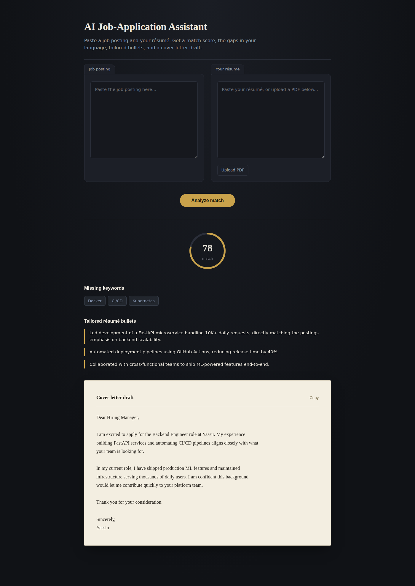

# AI Job-Application Assistant

Paste a job description and your resume — get back a match score, the
keywords you're missing, resume bullets rewritten to match the posting's
language, and a tailored cover letter draft.



## Why

Tailoring a resume and cover letter to every job posting is the single
highest-leverage thing you can do in a job search, and also the thing
almost nobody has time to actually do well. This automates the tedious
comparison step so you can focus on making sure the content is honest
and accurate.

## How it works

1. Your resume (pasted or uploaded as a PDF) and a job description go in.
2. Stage 1: the model extracts structured requirements from the job
   posting (required skills, preferred skills, experience level, tone).
3. Stage 2: the model compares your resume against those requirements
   and returns a match score, missing keywords, tailored bullet points,
   and a cover letter draft — as structured JSON, not free-form text.

Splitting the analysis into two LLM calls (extract, then compare) gives
more reliable output than asking one prompt to do everything at once.

## Tech stack

- **FastAPI** — backend API
- **Groq API** (`groq`) — free-tier LLM inference on open-weight models
  (Llama 3.3/3.1, Gemma 2), with automatic retry and model fallback if
  one model is rate-limited or unavailable
- **pdfplumber** — PDF resume text extraction
- **Vanilla HTML/CSS/JS** — custom dark-themed frontend, no build step,
  no framework

## Running locally

```bash
git clone <your-repo-url>
cd job-assistant
python -m venv venv
source venv/bin/activate   # Windows: venv\Scripts\activate
pip install -r requirements.txt
cp .env.example .env       # then add your GROQ_API_KEY
uvicorn main:app --reload
```

Open http://localhost:8000

Get a free Groq API key at https://console.groq.com/keys

## API

`POST /upload-resume` — multipart PDF upload, returns extracted text

`POST /analyze`
```json
{
  "resume_text": "...",
  "job_description": "..."
}
```
returns
```json
{
  "match_score": 78,
  "missing_keywords": ["Docker", "CI/CD"],
  "tailored_bullets": ["..."],
  "cover_letter_draft": "..."
}
```

## Deployment

A `Procfile` is included for Railway or Render:

1. Push this repo to GitHub
2. Create a new web service on [Railway](https://railway.app) or
   [Render](https://render.com), pointing at the repo
3. Add `GROQ_API_KEY` as an environment variable in the dashboard
4. Deploy — the platform reads the `Procfile` automatically

Free-tier deploys spin down when idle, so the first request after
inactivity can take 10-30 seconds.

## Notes

- The model is instructed not to fabricate experience — tailored bullets
  are rewrites of real resume content, not invented achievements.
- Groq's free tier is generous (1,000 requests/day, 30/minute as of
  writing) but each "Analyze match" click makes two LLM calls, and
  providers retire model versions on their own schedule. `llm.py` tries
  a short list of fallback models across different model families and
  retries automatically on rate limits or server errors — if all models
  in `MODEL_CANDIDATES` eventually get retired, check
  https://console.groq.com/docs/models and update the list.
- A 429 (rate limit) on one model automatically falls through to the
  next model in the list rather than failing the whole request — this
  was a real bug in an earlier version of this project that only
  retried on server errors, not rate limits.
- Dependency versions in `requirements.txt` are pinned for reproducibility.

## License

MIT — see [LICENSE](LICENSE).
